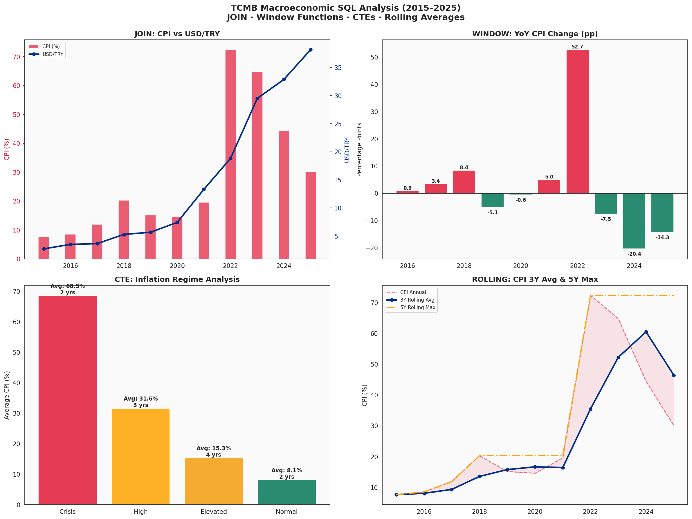
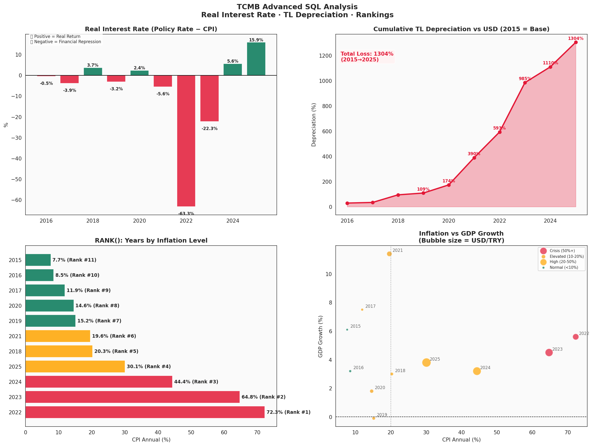

# 🗄️ TCMB Macroeconomic SQL Analysis

> SQL-based analysis of Turkey's macroeconomic indicators (2015–2025) using SQLite with advanced queries including JOIN, Window Functions, CTEs, RANK(), and Rolling Averages.

   

---

## 📌 Project Overview

This project builds a **3-table relational SQLite database** from TCMB (Central Bank of Turkey) macroeconomic data and performs advanced SQL analysis to uncover structural patterns in Turkey's inflation, exchange rate, monetary policy, and growth dynamics from 2015 to 2025.

**Key Questions:**
- What is the relationship between USD/TRY depreciation and CPI inflation?
- How did Turkey's real interest rate evolve across different inflation regimes?
- What does the cumulative TL depreciation look like since 2015?
- Which years rank highest on inflation, depreciation, and growth?

---

## 🔍 Key Findings

| Finding | Detail |
|---|---|
| 📉 TL Depreciation | Turkish Lira lost **1,304%** of its value vs USD (2015→2025) |
| 🔴 Real Rate | Negative real interest rates in **8 out of 11 years** (financial repression) |
| 📈 CPI-USD Correlation | **0.95+** correlation between USD/TRY and CPI inflation |
| ⚡ Crisis Peak | 2022: CPI hit **72.3%** while policy rate was only 9% (real rate: -63%) |
| 🟢 Normalization | 2024–2025: First positive real rates since 2020 (+5.6%, +15.9%) |
| 📊 Regime Analysis | Turkey spent **6 years** in High/Crisis inflation territory (2018–2025) |

---

## 🗄️ Database Structure

```sql
tcmb_macro.db
├── inflation          (year, cpi_annual, ppi_annual)
├── exchange_rates     (year, usd_try, eur_try)
└── macro_indicators   (year, policy_rate, gdp_growth,
                        unemployment, current_account_gdp)
```

---

## 🧮 SQL Techniques Used

| Technique | Query | Purpose |
|---|---|---|
| **JOIN** | `INNER JOIN` across 3 tables | Combine all macro indicators |
| **Window Functions** | `LAG()`, `FIRST_VALUE()` | YoY changes, base indexing |
| **CTE** | `WITH ... AS` | Inflation regime classification |
| **RANK()** | `RANK() OVER (ORDER BY ...)` | Year-by-year rankings |
| **Rolling Average** | `AVG() OVER (ROWS BETWEEN...)` | 3Y & 5Y moving averages |
| **CASE WHEN** | Conditional logic | Regime labeling |
| **Subqueries** | Nested CTEs | Multi-step transformations |

---

## 📊 Visualizations

### SQL Analysis Dashboard


### Advanced Analysis — Real Rates & Rankings


---

## 💡 Key SQL Queries

### 1. Three-Table JOIN
```sql
SELECT i.year, i.cpi_annual, e.usd_try, m.policy_rate
FROM inflation i
JOIN exchange_rates e ON i.year = e.year
JOIN macro_indicators m ON i.year = m.year
ORDER BY i.year
```

### 2. Window Function — YoY Change
```sql
SELECT year, cpi_annual,
    LAG(cpi_annual, 1) OVER (ORDER BY year) AS prev_cpi,
    cpi_annual - LAG(cpi_annual, 1) OVER (ORDER BY year) AS cpi_change
FROM inflation
```

### 3. CTE — Inflation Regime Classification
```sql
WITH high_inflation AS (
    SELECT year, cpi_annual,
        CASE
            WHEN cpi_annual >= 50 THEN 'Crisis'
            WHEN cpi_annual >= 20 THEN 'High'
            WHEN cpi_annual >= 10 THEN 'Elevated'
            ELSE 'Normal'
        END AS inflation_regime
    FROM inflation
)
SELECT inflation_regime, COUNT(*) AS years_count,
       AVG(cpi_annual) AS avg_cpi
FROM high_inflation
GROUP BY inflation_regime
```

### 4. RANK() — Year Rankings
```sql
SELECT year, cpi_annual,
    RANK() OVER (ORDER BY cpi_annual DESC) AS inflation_rank,
    RANK() OVER (ORDER BY usd_try DESC) AS depreciation_rank
FROM inflation
JOIN exchange_rates USING (year)
```

---

## 📂 Dataset

| Source | Description |
|---|---|
| [TCMB EVDS](https://evds2.tcmb.gov.tr) | Official Central Bank data portal |
| CPI (TÜFE) | Annual consumer price index |
| PPI (ÜFE) | Annual producer price index |
| USD/TRY, EUR/TRY | Annual average exchange rates |
| Policy Rate | TCMB benchmark interest rate |
| GDP Growth | Annual real GDP growth rate |

---

## 🛠️ Tools & Libraries

- **SQLite** — relational database engine
- **Python 3.10** · **pandas** · **numpy**
- **matplotlib** · **seaborn** — visualization
- **Google Colab** — cloud notebook environment

---

## 🚀 How to Run

```bash
git clone https://github.com/pars1905/tcmb-sql-analysis.git
cd tcmb-sql-analysis
pip install -r requirements.txt
jupyter notebook tcmb_sql_analysis.ipynb
```

---

## 📁 Repository Structure

```
tcmb-sql-analysis/
├── tcmb_sql_analysis.ipynb     ← Main SQL analysis notebook
├── tcmb_macro.db               ← SQLite database (3 tables)
├── tcmb_sql_analysis.png       ← SQL dashboard visualization
├── tcmb_sql_advanced.png       ← Advanced analysis visualization
└── README.md
```

---

## ⚠️ Disclaimer

This analysis is for **educational and portfolio purposes only**. Not investment advice.

---

## 👤 Author

**Osman Manay** — Applied Economist & Data Analyst  
[LinkedIn](https://linkedin.com/in/osman-manay-48b3171ba) · [GitHub](https://github.com/pars1905)

---

*SQL Portfolio · SQLite · Window Functions · CTEs · Macroeconomic Analysis · TCMB · Turkey*
